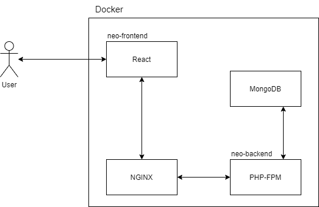

Welcome to the Symfony and React project.
========================

### First
First let's clone this project [https://github.com/Thomas-Matheus/clientsmanager.git](https://github.com/Thomas-Matheus/clientsmanager.git)

### Technology

- PHP 7.4 
- Symfony 5.2
- NODE 14.15
- React 17
- Git
- Composer
- Docker
- Docker-compose

Initial setting frontend
--------------

Move to frontend folder `neo-frontend` and run the command below.

Yarn or NPM command

    yarn install

or

    npm install

After use command Docker to run the `neo-frontend`

    docker-compose up -d

The server will run in the port `3000` and for access `http://localhost:3000`

Initial setting Backend
--------------

Move to frontend folder `neo-backend` and run the command below.

Composer command:

    composer install

After use command Docker to run the `neo-backend`

    docker-compose up -d

The server will run in the port `8080` and for access `http://localhost:8080/`

#### APIs aviables

| Method | Endpoint | Description |
| --- | --- | --- |
| GET | /api/status | Gets server status |
| GET | /api/client | Gets all clients |
| GET | /api/client/{id} | Get client search by id |
| POST | /api/client | Create a client from request body |
| PUT | /api/client/{id} | Update a client from request body searching by id |
| DELETE | /api/client/{id} | Delete a client by id | 

Into path `resource/postman` have postman request example file to import in the postman 
and make requests in `neo-backend`.

##### Request Add Client

```shell
$ curl --location --request POST 'http://localhost:8080/client' \
--header 'Content-Type: application/json' \
--data-raw '{
    "name": "Thomas Ferreira",
    "cpfCnpj": "53333461510",
    "blackList": false
}'

->  {"id":"5fdfc2873fb7d842bc0b6bf2","name":"Thomas Ferreira","cpfCnpj":"09678443473","blackList":true,"date":"2020-12-20T21:30:38+00:00"}
```

##### Request Status

Send a get to `/api/status`, as follow:

``` shell
$ curl --location --request GET 'http://localhost:8080/status'

-> { "uptime": "Days 0 hours 11 minutes 1", "average": 0 }
```


##### Testes

If you want, execute this command to run tests:

```bash
$ cd neo-backend/
$ ./bin/phpunit
```

##### A little about the architecture used.

Our user will access the `neo-frontend` made with React and Material UI.

The `neo-frontend` will make requests to NGINX and it will
forward the request to `neo-backend`, and `neo-backend` will receive 
this request and make operations like read, update, insert or delete in `Mongo DB`
at the end of the operation it will give an answer to `neo-frontend` to be displayed.

All the applications run inside the Docker and each one has container, but if you want can run manually in your machine.
Below a simple diagram to show how the application works.



---
#### Documentations

- [Docker](https://www.docker.com/get-started)
- [Docker compose](https://docs.docker.com/compose/install/)
- [Symfony](https://symfony.com/doc/5.2/setup.html) 
- [React](https://pt-br.reactjs.org/docs/getting-started.html)
- [Material UI](https://material-ui.com/pt/getting-started/example-projects/)